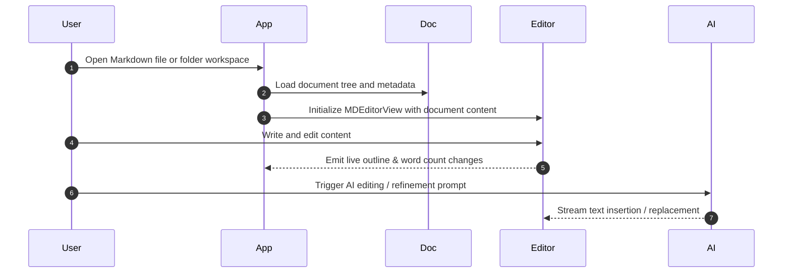

# Key flows

```mermaid
sequenceDiagram
    autonumber
    User->>App: Open Markdown file or folder workspace
    App->>Doc: Load document tree and metadata
    App->>Editor: Initialize MDEditorView with document content
    User->>Editor: Write and edit content
    Editor-->>App: Emit live outline & word count changes
    User->>AI: Trigger AI editing / refinement prompt
    AI-->>Editor: Stream text insertion / replacement
```
